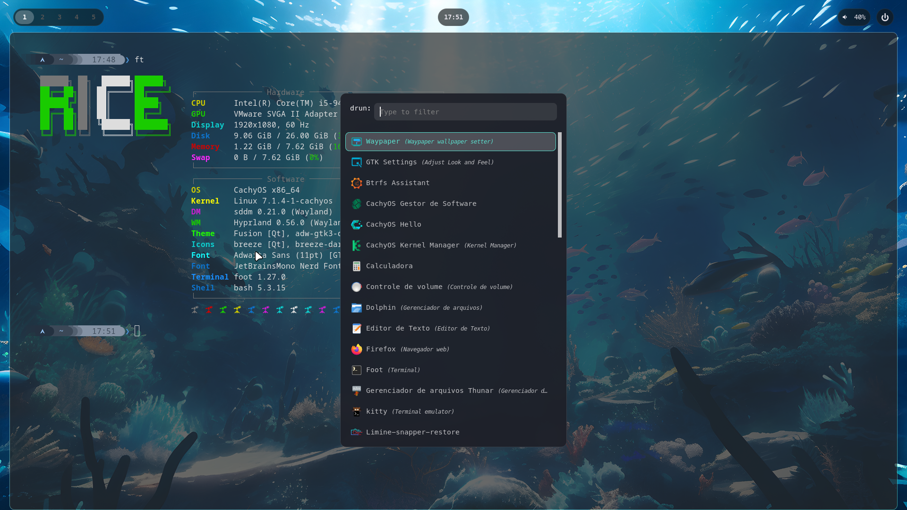

# hypr4 — dot-grey rice

Rice Hyprland minimalista baseado nos [dotfiles do Jules3182](https://github.com/Jules3182/dotfiles), adaptado para **CachyOS** em VM **VMware** (host `rice@192.168.86.247`).

Tema **Jules** com acento teal (`#5adecd`), wallpaper subaquático, **Foot**, **Rofi** drun, **Waybar** e **Thunar**.



## Estrutura

```
hypr4/
├── hyprland.lua          # entrypoint Lua
├── lua/                  # env, monitors, appearance, binds, autostart…
├── foot/                 # terminal (tema jules)
├── rofi/                 # launcher drun
├── waybar/               # barra superior + workspaces
├── scripts/              # wallpaper, wlogout, refresh waybar
└── wallpapers/           # wallpaper.jpg
```

## Ambiente

| Item | Valor |
|------|-------|
| SO | CachyOS (Arch) em VMware |
| Monitor | `Virtual-1`, `1920x1080@60`, escala `1` |
| Teclado | `br` / `abnt2` (`caps:escape`) |
| Fuso | `America/Sao_Paulo` |
| Cursor | Bibata-Modern-Ice 24px |
| Envs VMware | `WLR_NO_HARDWARE_CURSORS`, `WLR_RENDERER_ALLOW_SOFTWARE`, `AQ_DRM_DEVICES` |

## Atalhos principais

### Aplicações (`ALT`)

| Tecla | Ação |
|-------|------|
| `Alt+D` | Rofi drun (launcher) |
| `Alt+Return` | Foot (terminal) |
| `Alt+W` | Firefox |
| `Alt+X` | Wlogout |
| `Alt+E` | Thunar |
| `Alt+Q` | Fechar janela |
| `Alt+F` | Fullscreen |
| `Alt+F12` | Refresh Waybar |

### Janelas e layout (`SUPER`)

| Tecla | Ação |
|-------|------|
| `Super+R` | Reload acessórios |
| `Super+V` | Toggle float |
| `Super+P` | Pseudo |
| `Super+J` | Toggle split |
| `Super+←/→/↑/↓` | Foco entre janelas |
| `Super+1…0` | Workspace 1–10 |
| `Super+Shift+1…0` | Mover janela para workspace |

### Multimídia

Teclas `XF86Audio*` (volume/mute) e `XF86MonBrightness*` (brilho) via `wpctl` / `brightnessctl`.

## Instalação

1. Copie `hypr4/` para `~/.config/hypr4/`
2. Dependências: `hyprland`, `foot`, `rofi`, `waybar`, `thunar`, `wlogout`, `grim`, `swaybg` ou daemon de wallpaper, `wireplumber`, `brightnessctl`
3. Inicie a sessão apontando para `~/.config/hypr4/hyprland.lua`

```bash
Hyprland --config ~/.config/hypr4/hyprland.lua
```

## Créditos

- Base visual e binds: [Jules3182/dotfiles](https://github.com/Jules3182/dotfiles)
- Adaptação hypr4: dot-grey / vm_rice
